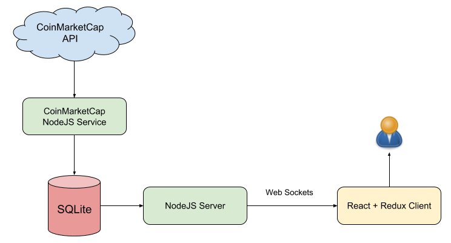
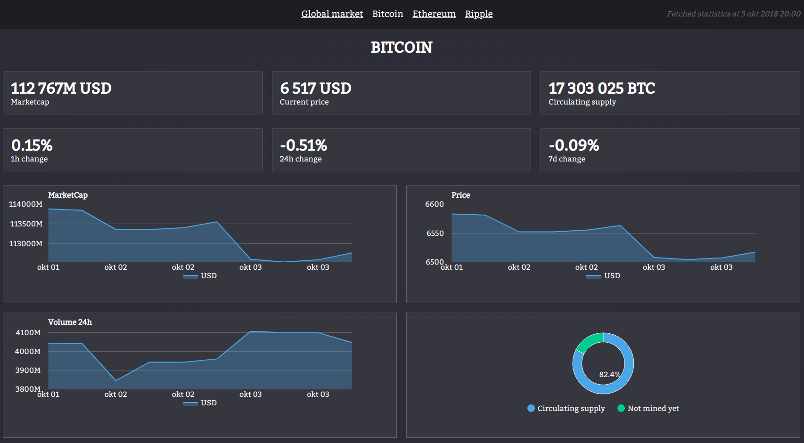

# CryptoDashboard

A dashboard for monitoring crypto currencies.

-   **/coinMarketCapService:** A NodeJS scheduler that collects data from CoinMarketCap API and saves this do DB
-   **/marketcap.sqlite:** SQLITE database which stores all historical data
-   **/server:** A Node JS server API for accessing and pushing (socket.io) data
-   **/client:** A React frontend with powerful graph capabilities from Google Graphs

# Setup

-   Install Node JS v8+ (check by (node -v")
-   Create a SQLite tables by importing ./marketcap.sqlite.sql and save to ./marketcap.sqlite. No data is included.
    [Use this portable tool](https://portableapps.com/apps/development/sqlite_database_browser_portable)
-   Change ./settings.json and add your CoinMarketCap API Key.

# Setup develop environment

## Start CoinMarketCap Service

-   Run npm install
-   run npm start, from /coinMarketCapService. You need to run this at least once to populate the database.

## Start Server API

-   Run npm install
-   run npm start, from /server (localhost:3001)

## Start client

-   Run npm install
-   run npm start, from /client (localhost:3000)

## Unit tests for client

-   Run npm test

# Data flow

# Screenshot

# Setup production environment

More info:

-   https://github.com/facebook/create-react-app/blob/master/packages/react-scripts/template/README.md#running-tests
-   https://redux.js.org/recipes/writing-tests

# Links and tools

-   https://pro.coinmarketcap.com/api/v1#section/Introduction
-   https://www.npmjs.com/package/react-google-charts
-   https://portableapps.com/apps/development/sqlite_database_browser_portable
